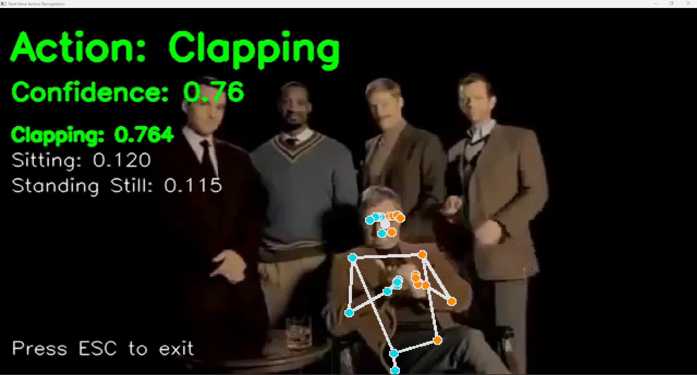

# YOLOv8 ile Gerçek Zamanlı Video Akışında İnsan Sayımı ve Yoğunluk Tespiti
Bu proje, bir video akışı üzerinden **YOLOv8 nano (yolov8n) modeli** kullanarak gerçek zamanlı insan tespiti, takibi ve sayımı yapar. Tespit edilen nesneleri görselleştirerek, her karedeki anlık insan sayısını, videodaki toplam benzersiz insan sayısını ve insan yoğunluğunu hesaplayarak çıktı video olarak kaydeder. Temel amacımız, video içerisindeki insan varlığını hızlı ve etkili bir şekilde tespit etmek, takip etmek ve bu süreci anlaşılır bir şekilde görselleştirmektir.
> Proje, Python dilinde geliştirilmiş olup, güçlü nesne algılama ve takip kütüphanelerini kullanmaktadır.
---
## İçindekiler
- [Proje Amacı](#proje-amacı)
- [Proje Özellikleri](#proje-özellikleri)
- [YOLOv8 Nano Model Nedir?](#yolov8-nano-model-nedir)
- [ByteTrack Kütüphanesi Nedir?](#bytetrack-kütüphanesi-nedir)
- [Kullanılan Teknolojiler](#kullanılan-teknolojiler)
- [Kurulum](#kurulum)
- [Kullanım](#kullanım)
- [Örnek Görseller](#tespit-örneği-görselleri)
---
## Proje Amacı
Bu projenin temel amacı, **YOLOv8 nano (yolov8n)** gibi modern bir derin öğrenme modelini ve **ByteTrack** gibi bir nesne takip algoritmasını kullanarak gerçek dünya video akışlarında insan tespiti, takibi ve sayımı yeteneğini sergilemektir. Özellikle:
* **Gerçek Zamanlı İnsan Tespiti ve Takibi:** Video kareleri üzerinde yüksek performansla insanları algılamak ve benzersiz ID'lerle takip etmek.
* **İnsan Sayımı:** Her bir karedeki anlık insan sayısını ve tüm video boyunca görünen toplam benzersiz insan sayısını hesaplamak.
* **Kalabalık Yoğunluğu Tespiti:** Tespit edilen insan sayısına göre video alanındaki yoğunluğu tahmin etmek.
* **Görselleştirme:** Tespit edilen nesnelerin üzerine sınır kutuları, etiketler ve sayım bilgileri çizerek algılama ve takip sonuçlarını anlaşılır kılmak.
* **Uygulama Alanları:** Güvenlik, trafik analizi, kalabalık yönetimi, perakende analizi gibi çeşitli alanlarda temel bir altyapı sunmak.
---
## Proje Özellikleri
- Belirtilen video dosyasından **kareleri okuma ve işleme**.
- **YOLOv8 nano modeli** ile video akışında **gerçek zamanlı insan tespiti** (sadece `person` sınıfı).
- **ByteTrack** algoritması ile tespit edilen insanları benzersiz kimliklerle **takip etme**.
- Her karede **anlık insan sayısını** ve tüm video boyunca görünen **toplam benzersiz insan sayısını** hesaplama.
- Videodaki insan **yoğunluğunu** (piksel başına düşen insan sayısı) hesaplama.
- Tespit edilen nesnelerin üzerine **sınır kutuları (bounding boxes)**, etiketler (sınıf adı, güven skoru, takip ID) çizme.
- Ekran üzerinde **anlık sayım ve toplam sayım bilgilerini** görselleştirme.
- İşlenmiş video akışını yeni bir **MP4 dosyasına kaydetme**.
- Sağlam **hata yönetimi** ve kaynak yönetimi (video okuma/yazma).
---
## YOLOv8 Nano Model Nedir?
**YOLO (You Only Look Once)**, gerçek zamanlı nesne algılama alanında devrim niteliğinde bir derin öğrenme modelidir. Geleneksel yöntemlerin aksine, görüntüyü tek bir geçişte işleyerek hem nesnelerin konumunu hem de sınıflarını tahmin eder, bu da onu oldukça hızlı yapar.

<small>(source: https://www.mdpi.com/2076-3417/14/17/7686)</small>
**YOLOv8 nano (`yolov8n.pt`) modeli** ise YOLOv8 serisinin en küçük ve en hızlı varyantıdır. Daha az parametreye sahip olması ve daha az hesaplama gücü gerektirmesi sayesinde, **düşük kaynaklı cihazlarda veya gerçek zamanlı uygulamalarda yüksek performans** sunar. Boyutuna rağmen, hala etkileyici bir doğrulukla nesneleri tespit edebilir. Bu projenin hızlı ve pratik bir çözüm sunabilmesi için ideal bir seçimdir.
---
## ByteTrack Kütüphanesi Nedir?
**ByteTrack**, yüksek performanslı ve doğru çoklu nesne takibi için tasarlanmış modern bir takip algoritmasıdır. Özellikle nesnelerin geçici olarak kaybolduğu veya örtüştüğü durumlarda bile sağlam takip yeteneğiyle öne çıkar. Düşük güven skoruna sahip tespitleri bile değerlendirerek, nesne kimliklerinin daha uzun süre korunmasına yardımcı olur ve bu sayede sayım gibi uygulamalarda daha doğru sonuçlar elde edilmesini sağlar. Projemizde insan sayımı için bu kütüphanenin takip yeteneklerinden faydalanıyoruz.
---
## Kullanılan Teknolojiler
-   **Python:** Temel programlama dili.
-   **YOLOv8:** Gerçek zamanlı nesne algılama modeli (özellikle `yolov8n.pt` nano modeli).
-   **OpenCV (`cv2`):** Video okuma, yazma ve temel görüntü işleme operasyonları için güçlü bir kütüphane.
-   **Supervision:** Nesne algılama ve takip sonuçlarını kolayca görselleştirmek için (sınır kutuları, etiketleme ve ByteTrack entegrasyonu) kullanılan modern bir kütüphane.
-   **Ultralytics:** YOLOv8 modelinin kullanımı ve eğitimi için temel kütüphane.
-   **ByteTrack:** Yüksek performanslı ve doğru nesne takibi için kullanılan algoritma.
---
## Kurulum
Projeyi yerel makinenizde çalıştırmak için aşağıdaki adımları izleyin:
1.  **Python Ortamı Oluşturma:** Python 3.8 veya üzeri yüklü olduğundan emin olun. Bağımlılık çakışmalarını önlemek için bir **sanal ortam** kullanmanız şiddetle tavsiye edilir:
    ```bash
    python -m venv venv
    # Linux/macOS için sanal ortamı etkinleştirin:
    source venv/bin/activate
    # Windows için sanal ortamı etkinleştirin:
    .\venv\Scripts\activate
    ```
2.  **Bağımlılıkların Yüklenmesi:** Gerekli tüm Python kütüphanelerini `pip` kullanarak yükleyin:
    ```bash
    pip install opencv-python ultralytics supervision
    ```
3.  **Model Ağırlıklarının İndirilmesi:** YOLOv8 nano model ağırlıkları (`yolov8n.pt`), ilk çalıştırıldığında Ultralytics kütüphanesi tarafından otomatik olarak indirilecektir. İnternet bağlantınızın olduğundan emin olun.
---
## Kullanım
## Proje Yapısı
Projenin temel dizin ve dosya yapısı aşağıdaki gibidir:
````
.
├── pose_classification/
│   ├── dataset/
│   │   ├── action_log_simple.json
│   │   ├── audrey.mp4
│   │   ├── best_action_model.h5
│   │   ├── label_encoder.pkl
│   │   ├── man.mp4
│   │   ├── person_actions_log.csv
│   │   ├── test01.mp4
│   │   └── test02.mp4
│   ├── extract_keypoints_from_videos.py
│   ├── improved_multiperson_detection...
│   ├── multiperson_detection.py
│   ├── pose_detection.py
│   ├── real_time_prediction.py
│   ├── train_classifier.py
│   └── yolov8n.pt
├── pose_estimation/
│   ├── images/
│   │   └── (örnek görseller)
│   ├── pose_estimation.py
│   └── realtime_pe.py
└── README.md
````

1.  İşlemek istediğiniz video dosyasını projenizin ana dizinindeki `xxx.mp4` yoluna yerleştirin. (Alternatif olarak, kod içerisindeki `video_path` değişkenini kendi video dosyanızın yolu ile güncelleyebilirsiniz.)
    **Video Kaynağı Önerisi:** Kendi videolarınız yoksa veya farklı insan videolarıyla deneme yapmak isterseniz, telifsiz ve yüksek kaliteli insan videolarını [Pexels Video Kütüphanesi](https://www.pexels.com/search/videos/human/) üzerinden edinebilirsiniz.
ben Kaggele üzerinden aşağıdaki linkten verileri elde ettim :
https://www.kaggle.com/datasets/sharjeelmazhar/human-activity-recognition-video-dataset/data
2.  Ana Python betiğini çalıştırın (betiğinizin adı örneğin `main_counting_script.py` ise):
    ```bash
    python main_counting_script.py
    ```
3.  İşlem tamamlandığında, algılanan insanları, çizilen sınır kutularını, takip ID'lerini ve sayım bilgilerini içeren çıktı videosu, projenin `output/street_detection.mp4` konumunda bulunacaktır. Konsolda ayrıca toplam benzersiz kişi sayısı yazdırılacaktır.
---
## Tespit Örneği Görselleri
### 📌 1. Pose Estimation
Aşağıdaki görselde yalnızca tek bir karede (fotoğrafta) iskelet çıkarımı yapılmıştır:
<p>
  
  
</p>


### 📌 2. Pose Classification (Real-time)
Bu görselde ise videodan alınan keypoint'ler ile "clapping" hareketi başarıyla sınıflandırılmıştır:
<p>
  
  
</p>
